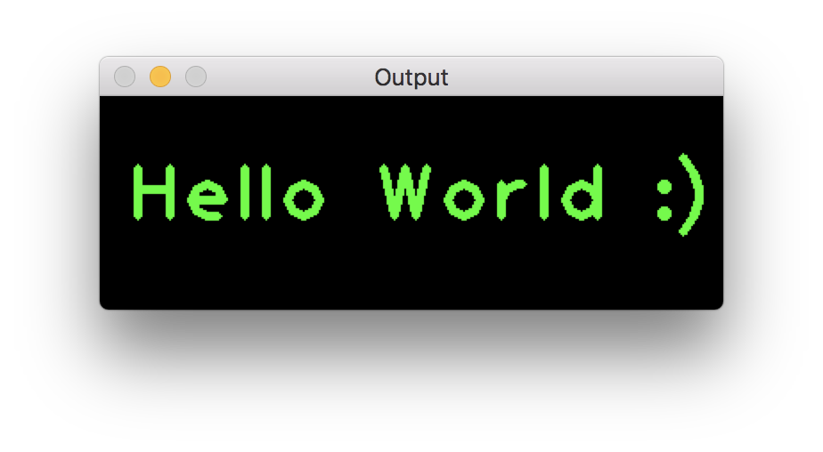

## OpenCV example for XCode

```
HEADER_SEARCH_PATHS = /usr/local/Cellar/opencv/3.4.3/include;
LIBRARY_SEARCH_PATHS = /usr/local/Cellar/opencv/3.4.3/lib;
OTHER_LDFLAGS = (
	"-lopencv_highgui",
	"-lopencv_core",
	"-lopencv_imgproc",
);	
```

## Screenshot


